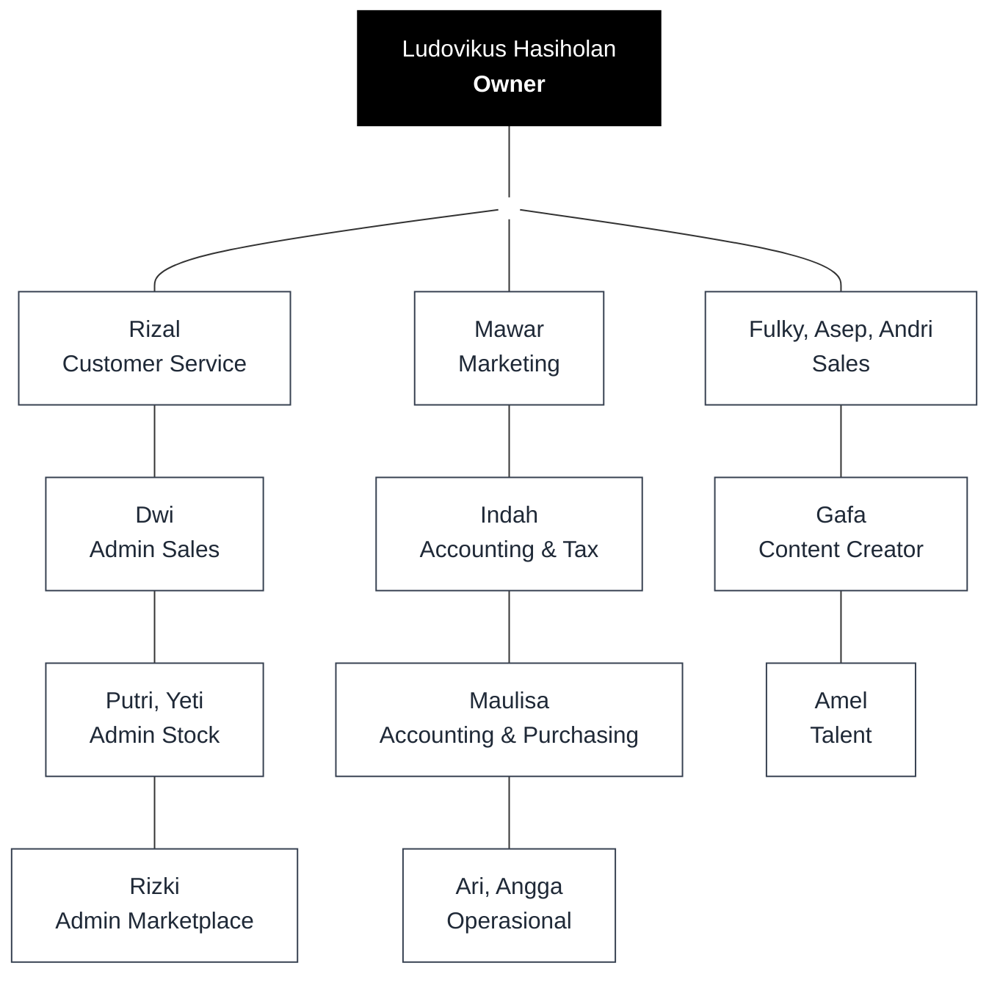
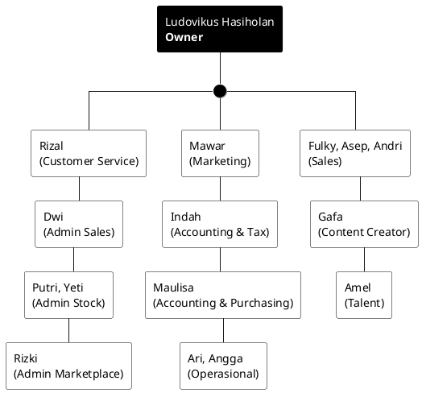

# Struktur Organisasi CV Panca Indra Keemasan

Berikut adalah visualisasi struktur organisasi perusahaan CV Panca Indra Keemasan yang telah disempurnakan.

## 1. Diagram Mermaid (Model Bagan 3 Kolom - Clean)

## 2. Diagram PlantUML (Model Bagan 3 Kolom - Clean)

