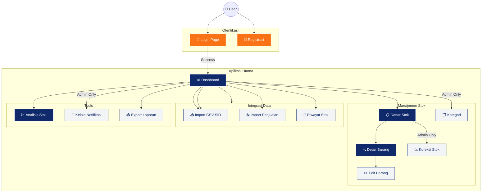

# Visualisasi Arsitektur Frontend

Dokumen ini memetakan struktur file, hierarki, dan alur navigasi antarmuka pengguna (Frontend) pada aplikasi **Stock Monitoring Assistant**.

## 🌳 Struktur Direktori Frontend

Berikut adalah struktur pohon detail dari file-file yang membentuk tampilan aplikasi:

```text
resources/
├── 📂 css/
│   └── 🎨 app.css                  # Stylesheet global (Custom Vanilla CSS)
├── 📂 js/
│   ├── 📜 app.js                   # Entry point JavaScript
│   └── ⚙️ bootstrap.js             # Konfigurasi dasar (Axios, dll)
└── 📂 views/
    ├── 🏠 welcome.blade.php        # Halaman Landing (Default Laravel)
    └── 📂 kp/                      # [MODUL UTAMA] Kerja Praktek
        ├── 🔐 Otentikasi
        │   ├── login_blade.blade.php    # Halaman Login
        │   └── registrasi.blade.php     # Halaman Registrasi Staff
        │
        ├── 📊 Dashboard & Monitoring
        │   ├── dashboard.blade.php      # Dashboard Utama (Ringkasan)
        │   ├── daftar_stok.blade.php    # Tabel Monitoring Stok Real-time
        │   └── analisis_stok.blade.php  # Grafik & Visualisasi Data Persediaan
        │
        ├── 📦 Manajemen Barang
        │   ├── detail_barang.blade.php       # Informasi Detail per Item
        │   ├── edit_detail_barang.blade.php  # Form Edit Data Barang
        │   ├── kategori_barang.blade.php     # Manajemen Kategori
        │   └── koreksi_stok.blade.php        # Form Stock Opname (Penyesuaian Manual)
        │
        ├── 🔄 Integrasi Data
        │   ├── import.blade.php           # Import Data CSV dari SID
        │   ├── import_penjualan.blade.php # Import Data Penjualan App 2
        │   └── riwayat_stok.blade.php     # Log History Barang Masuk
        │
        └── ⚙️ Utilitas & Laporan
            ├── kelola_notifikasi.blade.php  # Konfigurasi Threshold Alert
            ├── export_laporan.blade.php     # Panel Download Laporan (Excel)
            └── export_pdf_preview.blade.php # Template Cetak PDF
```

## 🗺️ Peta Navigasi & Alur View (Mermaid)

Diagram barikut menggambarkan hubungan navigasi antar halaman utama dalam aplikasi.



## 📋 Rincian Fungsionalitas View

| Nama File (`resources/views/kp/`) | Tipe Halaman | Deskripsi Fungsional |
| :--- | :--- | :--- |
| `dashboard.blade.php` | **Dashboard** | Pusat kendali, menampilkan widget ringkasan stok kritis, total aset, dan navigasi cepat. |
| `daftar_stok.blade.php` | **Index / List** | Tabel utama inventory dengan fitur pencarian, filter kategori, dan indikator warna status stok. |
| `analisis_stok.blade.php` | **Chart / Analisis** | Visualisasi data menggunakan grafik batang untuk melihat item *fast-moving* atau *dead-stock*. |
| `detail_barang.blade.php` | **Detail / Show** | Menampilkan informasi lengkap satu item termasuk kode, harga, dan stok. |
| `import.blade.php` | **Form Action** | Antarmuka untuk mengunggah file CSV dari sistem eksternal (SID) guna sinkronisasi stok. |
| `kelola_notifikasi.blade.php` | **Settings** | Halaman pengaturan untuk menentukan batas minimum stok (global/per-kategori) agar notifikasi muncul. |
